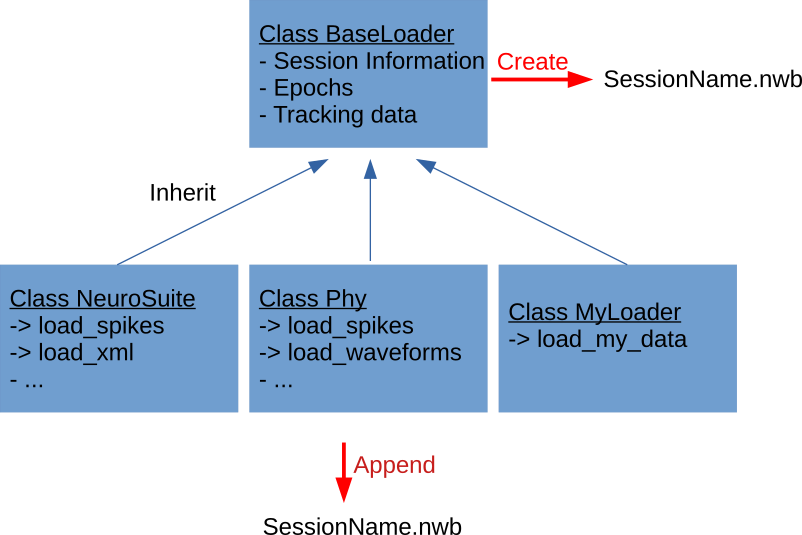

# nwbmatic

_NWB creator from various data streams_

TODO badges

Overview
--------

This package started as a main feature of [pynapple](https://github.com/pynapple-org/pynapple) IO module. It is now a standalone package to help create NWB from various data streams from electrophysiological and calcium imaging pipelines. It supports outputs from :

| _Electrophysiology_ | _Calcium imaging_ | _Behavior_   |
| ------------------- | ----------------- | ------------ |
| Phy                 | matlab CNMF-E     | DeepLabCut   |
| Neurosuite          | Inscopix CNMF-E   | Optitrack    |
|                     | Minian 	          |              |
|                     | Suite2P           |              |


> **Warning**
> A larger choice of data format is available from [neuroconv](https://github.com/catalystneuro/neuroconv)

Usage
-----

The general workflow of loading a session is described by the infographic below. As it is challenging to accomodate all possible types of format, we aimed to keep the IO of nwbmatic minimal while allowing the user to inherit the base loader and import their own custom io functions. 

The base loader is thus responsible for initializing the NWB file containing the tracking data, the epochs and the session informations.




Getting Started
---------------

### Installation

The best way to install nwbmatic is with pip within a new [conda](https://docs.conda.io/en/latest/) environment :

    
``` {.sourceCode .shell}
$ conda create --name nwbmatic pip python=3.8
$ conda activate nwbmatic
$ pip install nwbmatic
```

or directly from the source code:

``` {.sourceCode .shell}
$ conda create --name nwbmatic pip python=3.8
$ conda activate nwbmatic
$ # clone the repository
$ git clone https://github.com/pynapple-org/nwbmatic.git
$ cd nwbmatic
$ # Install in editable mode with `-e` or, equivalently, `--editable`
$ pip install -e .
```

This procedure will install all the dependencies including 

> -   pynapple
> -   pandas
> -   numpy
> -   pynwb 2.0
> -   h5py

Example
-------

In this example, a session preprocessed with _phy_ will be copied to NWB and loaded.

```python
import nwbmatic as ntm

data = ntm.load_session("path/to/my/session", "phy")
```

Credits
-------

Thanks to Selen Calgin, Sara Mahallati and Luigi Petrucco for their contributions.


