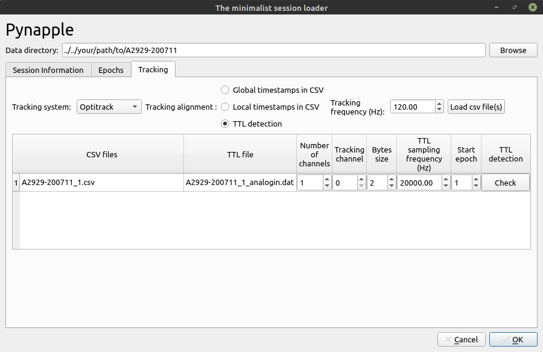
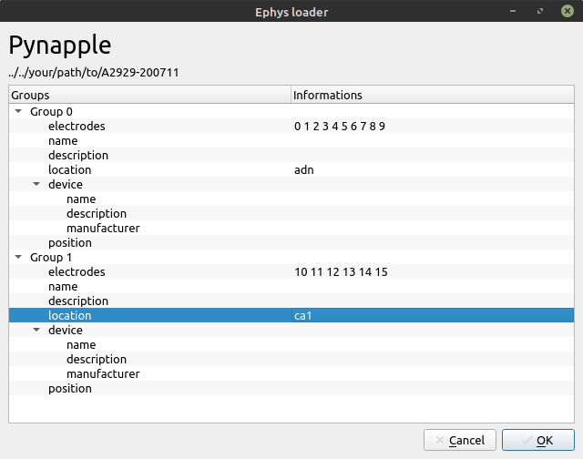
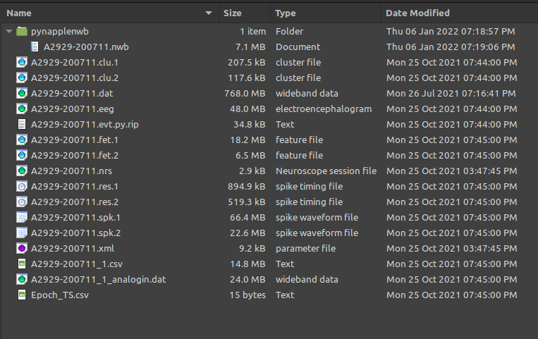

# Tutorial

In this [example dataset](https://www.dropbox.com/s/1kc0ulz7yudd9ru/A2929-200711.tar.gz?dl=1), the data contains a sample recording from the anterodorsal nucleus of the thalamus and the hippocampus, with both a sleep and a wake phase. It contains both head-direction cells (i.e. cells that fire for a particular direction of the head in the horizontal plane) and place cells (i.e. cells that fire for a particular position in the environment).

The example dataset looks like this:


Preprocessing of the data was made with [Kilosort 2.0](https://github.com/MouseLand/Kilosort) and spike sorting was made with [Klusters](http://neurosuite.sourceforge.net/).

Tracking of the animal was done with Motive Optitrack. The file _A2929-200711_1.csv_ contains the tracking data (both position and rotation of the head of the animal).

The binary file _A2929-200711_1_analogin.dat_ contains the TTL pulses tracking the camera frames.

This tutorial demonstrates how to load data with nwbmatic.

---
## Import nwbmatic

```python
import nwbmatic as ntm
```

---
## Session loader

The first step is to call the function [*load_session*](https://pynapple-org.github.io/nwbmatic/io/). It will then open a GUI for filling manually the information. The following screenshots show what parameters to use.


```python
data_directory = 'your/path/to/A2929-200711'

data = ntm.load_session(data_directory, 'neurosuite')
```

---
### Session Information


The second step is to provides information about the session and the subject. All the fields shown are suggested by the NWB format (see [here](https://pynwb.readthedocs.io/en/stable/pynwb.file.html#pynwb.file.Subject) and [here](https://pynwb.readthedocs.io/en/stable/pynwb.file.html#pynwb.file.NWBFile)).


---
### Epochs


The epochs tab loads the epochs within the session (typically wake and sleep). In this case, we load the file _Epoch_Ts.csv_ in the data folder. The first column contains the start of the epoch and the second column contains the end of the epoch.

If the CSV file contains a third column with an epoch label, the loader will automatically write it in the label column. Otherwise, it is necessary to manually write the epoch labels.

---
### Tracking

The tracking tab allows to load tracking data saved with a CSV file. Reading a CSV file is always a challenge when the header is unknown. The default csv file should contains only one row for the header with the column names. The first column should be the time index in seconds. Other formats are DeepLabCut and Optitrack.

Frame alignement can vary as well. Pynapple offers three ways to align the tracking frames :

#### Global timestamps
The time column of the CSV file contains the timestamps aligned to the global timeframe of the session.
#### Local timestamps
The time column of the CSV file contains the timestamps aligned to one epoch. In this case, the user should select which epoch.
#### TTL detection
A binary file containing TTL pulses for each tracking frame is located within the folder and can be loaded. Alignement is made with TTL detection.

In this example session, Tracking was made with Optitrack and TTL pulses were written to an analogin file recorded by an Intan RHD2000 recording system. The parameters for the tracking tab are shown below.



---
## Ephys loader

The next step is specific to NeuroSuite. In this case, 2 electrophysiological probes were implanted, one to the ADN and another to the CA1. This step allows to label groups of electrodes as shown below.




## NWB file

If successful, a NWB file should be created in __session_folder/pynapplenwb/session_name.nwb__



Calling the function *load_session* should directly read the NWB file and bypass the GUI loader.


```python
data = ntm.load_session(data_directory, 'neurosuite')
```

In this case, the data that can be used for analysis are *spikes*, *position* and *epochs*.


```python
spikes = data.spikes
position = data.position
epochs = data.epochs

print(spikes, '\n')
print(position, '\n')
print(epochs, '\n')
```

      Index    Freq. (Hz)    group
    -------  ------------  -------
          0          7.3         0
          1          5.73        0
          2          8.12        0
          3          6.68        0
          4         10.77        0
          5         11           0
          6         16.52        0
          7          2.2         1
          8          2.02        1
          9          1.07        1
         10          3.92        1
         11          3.31        1
         12          1.09        1
         13          1.28        1
         14          1.32        1 
    
                      rx        ry        rz         x         y         z
    Time (s)                                                              
    670.64070   0.343163  5.207148  5.933598 -0.042857  0.425023 -0.195725
    670.64900   0.346745  5.181029  5.917368 -0.043863  0.424850 -0.195110
    670.65735   0.344035  5.155508  5.905679 -0.044853  0.424697 -0.194674
    670.66565   0.322240  5.136537  5.892457 -0.045787  0.424574 -0.194342
    670.67400   0.315836  5.120850  5.891577 -0.046756  0.424563 -0.194059
    ...              ...       ...       ...       ...       ...       ...
    1199.96160  6.009812  3.665954  0.230562  0.011241  0.037891 -0.001479
    1199.96995  6.014660  3.634619  0.260742  0.010974  0.038677 -0.002370
    1199.97825  6.031694  3.617849  0.276835  0.010786  0.039410 -0.003156
    1199.98660  6.040435  3.609446  0.287006  0.010661  0.040064 -0.003821
    1199.99495  6.050059  3.609375  0.293275  0.010624  0.040568 -0.004435
    
    [63527 rows x 6 columns] 
    
    {'sleep':    start    end
    0    0.0  600.0, 'wake':    start     end
    0  600.0  1200.0} 
    
